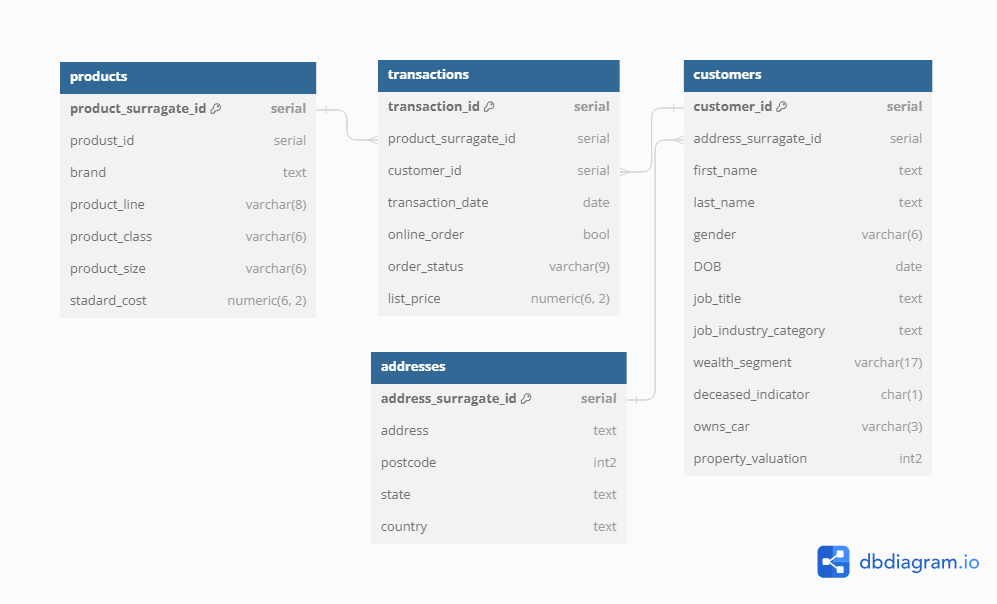
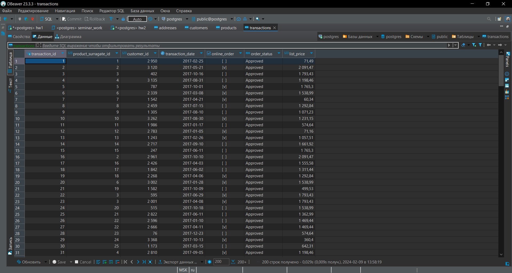
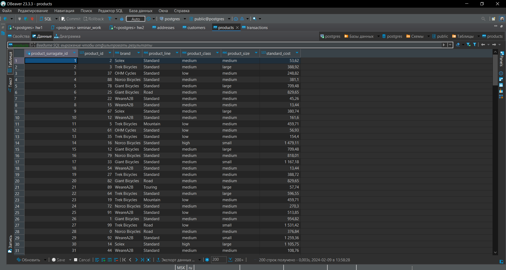
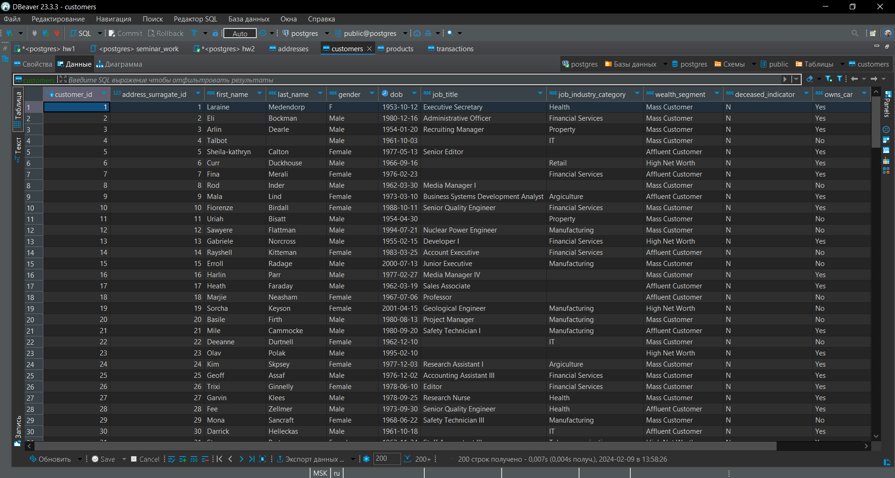
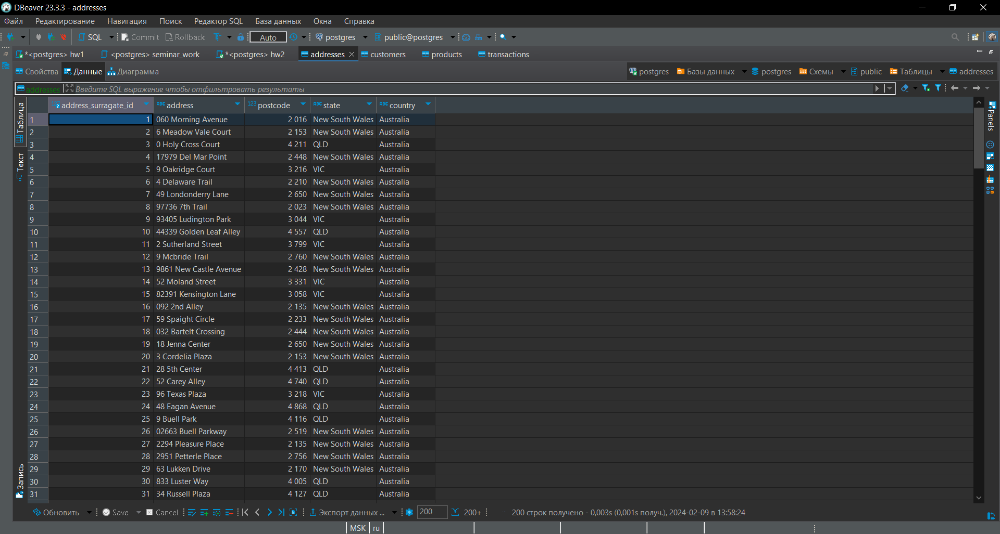

# Домашние задание №1
## Студент: Глазков Тимур Михайлович

# Задачи:
1. Продумать структуру базы данных и отрисовать в редакторе.

2. Нормализовать базу данных (1НФ — 3НФ), описав, к какой нормальной форме приводится таблица и почему таблица в этой нормальной форме изначально не находилась.

3. Создать все таблицы в DBeaver, указав первичные ключи к таблицам, правильные типы данных, могут ли поля быть пустыми или нет (использовать команду CREATE TABLE).

4. Загрузить данные в таблицы в соответствии с созданной структурой (использовать команду INSERT INTO или загрузить файлы, используя возможности инструмента DBeaver; в случае загрузки файлами приложить скрины, что данные действительно были залиты).

---

# №1 Структура БД:


---

# №2 Нормализация БД:
1. Изначально таблица находилась в **1НФ**, так как все столбцы содержат только 1 скалярно значение, отсутствуют повторы строк, поля атомарны.

2. Таблица была приведена ко **2НФ** путём отделения полей относящихся к уникальным продуктам, от таблицы **transactions** и сохранения их в отдельную таблицу **products**. Так же был создан сурагатный ключ, для таблицы **products**, так как значения **product_id** не были уникальны. Таким образом значения обеих таблиц приобрели зависимость только от первичного ключа.

3. Далее таблица была приведена к **3НФ** путём отделения от таблицы **customers** полей, имеющих отношение к адресу и сохранения их в отдельную таблицу **addresses**. Так же был создан сурагатный ключ, для таблицы **addresses**, для установления связи с таблицей customers (исходный первичный ключ **custimer_id** не используется в качестве первичного ключа в таблице **addresses**, во избежании потенциальных зависимостей **one-to-many**, **many-to-one** клиентов к адресам). Таким образом была устранена транзитивная зависимость.

### Код нормализации данных представлен в ноутбуке "data_normalization.ipynb" 

---

# №3 Создание таблиц:
```sql
create table if not exists transactions (
  transaction_id serial not null unique primary key
  ,product_surragate_id serial not null
  ,customer_id serial not null
  ,transaction_date date
  ,online_order bool
  ,order_status varchar(9)
  ,list_price numeric(6, 2) not null
);


create table if not exists products (
  product_surragate_id serial not null unique primary key
  ,product_id serial
  ,brand text
  ,product_line varchar(8)
  ,product_class varchar(6)
  ,product_size varchar(6)
  ,standard_cost numeric(6, 2)
);


create table if not exists customers (
  customer_id serial not null unique primary key 
  ,address_surragate_id serial
  ,first_name text
  ,last_name text
  ,gender varchar(6)
  ,DOB date
  ,job_title text
  ,job_industry_category text
  ,wealth_segment text
  ,deceased_indicator char(1)
  ,owns_car varchar(3)
  ,property_valuation int2
);
  
  
create table if not exists addresses (
  address_surragate_id serial not null unique primary key
  ,address text not null
  ,postcode int2 not null
  ,state text
  ,country text
);
```

### Так же код создания таблиц представлем в sql-скрипте "table_cration.sql"

---

# №4 Загрузка Данных:
### 1. Таблица "transactions"


### 2. Таблица "products"


### 3. Таблица "customers"


### 4. Таблица "addresses"
