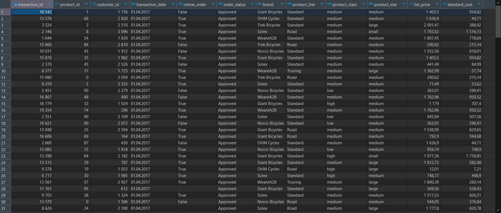
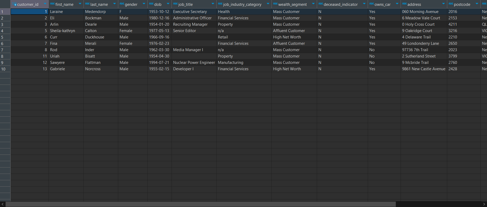
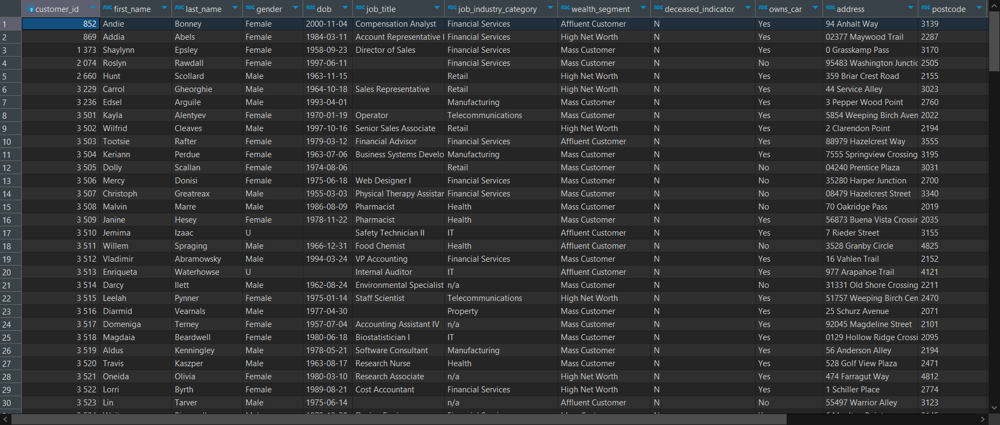
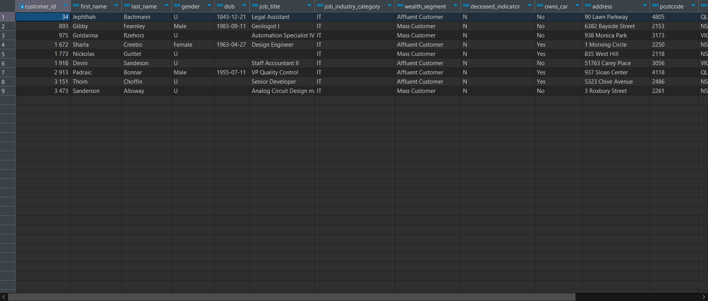
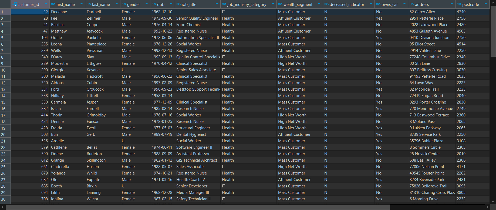

# Домашние задание №2: Основные операторы PostgreSQL
## Студент: Глазков Тимур Михайлович

# Задачи:
1. Создать таблицы со следующими структурами и загрузить данные из csv-файлов. 
2. Выполнить следующие запросы:
    1. Вывести все уникальные бренды, у которых стандартная стоимость выше 1500 долларов.
    2. Вывести все подтвержденные транзакции за период '2017-04-01' по '2017-04-09' включительно.
    3. Вывести все профессии у клиентов из сферы IT или Financial Services, которые начинаются с фразы 'Senior'.
    4. Вывести все бренды, которые закупают клиенты, работающие в сфере Financial Services
    5. Вывести 10 клиентов, которые оформили онлайн-заказ продукции из брендов 'Giant Bicycles', 'Norco Bicycles', 'Trek Bicycles'.
    6. Вывести всех клиентов, у которых нет транзакций.
    7. Вывести всех клиентов из IT, у которых транзакции с максимальной стандартной стоимостью.
    8. Вывести всех клиентов из сферы IT и Health, у которых есть подтвержденные транзакции за период '2017-07-07' по '2017-07-17'.

---

# №1 Создание таблиц:
```sql
create table if not exists customer (
	customer_id int4 primary key
	,first_name varchar(50)
	,last_name varchar(50)
	,gender varchar(30)
	,DOB varchar(50)
	,job_title varchar(50)
	,job_industry_category varchar(50)
	,wealth_segment varchar(50)
	,deceased_indicator varchar(50)
	,owns_car varchar(30)
	,address varchar(50)
	,postcode varchar(30)
	,state varchar(30)
	,country varchar(30)
	,property_valuation int4
);

create table if not exists transaction (
	transaction_id int4 primary key
	,product_id int4
	,customer_id int4
	,transaction_date varchar(30)
	,online_order varchar(30)
	,order_status varchar(30)
	,brand varchar(30)
	,product_line varchar(30)
	,product_class varchar(30)
	,product_size varchar(30)
	,list_price float4
	,standard_cost float4
);
```

# №2 Запросы к БД:

## 1. Вывести все уникальные бренды, у которых стандартная стоимость выше 1500 долларов.

```sql
select distinct brand from (
	select brand, standard_cost from transaction
	where standard_cost > 1500) sub_t
order by brand;
```
### Результат:


## 2. Вывести все подтвержденные транзакции за период '2017-04-01' по '2017-04-09' включительно.

```sql
select * from transaction t
	where transaction_date::date
		between '2017-04-01' and '2017-04-09'
	and order_status = 'Approved'
order by transaction_date;
```
### Результат:



## 3. Вывести все профессии у клиентов из сферы IT или Financial Services, которые начинаются с фразы 'Senior'.

```sql
select distinct job_title from (
	select job_title, job_industry_category from customer
	where job_industry_category in ('IT', 'Financial Services')
		and job_title like 'Senior%') sub_c
order by job_title;
```
### Результат:


## 4. Вывести все бренды, которые закупают клиенты, работающие в сфере Financial Services

```sql
select distinct brand from (
	select brand, job_industry_category from transaction t
	join customer c
		on t.customer_id = c.customer_id
	where job_industry_category = 'Financial Services') sub_joined
order by brand;
```
### Результат:


## 5. Вывести 10 клиентов, которые оформили онлайн-заказ продукции из брендов 'Giant Bicycles', 'Norco Bicycles', 'Trek Bicycles'.

```sql
with filtered_customers as (
	select c.customer_id from customer c
	join transaction t
		on c.customer_id = t.customer_id
	where t.online_order = 'True'
		and t.brand in ('Giant Bicycles', 
			'Norco Bicycles', 'Trek Bicycles')
	order by c.customer_id)
select * from customer
where customer_id in (
	select customer_id from filtered_customers)
limit 10;
```
### Результат:



## 6. Вывести всех клиентов, у которых нет транзакций.

```sql
select * from customer
where customer_id in (
	select c.customer_id from customer c 
	left join transaction t 
		on c.customer_id = t.customer_id
	where t.customer_id is null)
order by customer_id;
```
### Результат:



## 7. Вывести всех клиентов из IT, у которых транзакции с максимальной стандартной стоимостью.

```sql
select * from customer c 
where customer_id in (
	select c.customer_id from customer c
	join transaction t
		on c.customer_id = t.customer_id
	where c.job_industry_category = 'IT'
		and t.standard_cost = (
			select max(standard_cost) 
			from transaction))
order by customer_id;
```
### Результат:



## 8. Вывести всех клиентов из сферы IT и Health, у которых есть подтвержденные транзакции за период '2017-07-07' по '2017-07-17'.

```sql
select * from customer c 
where customer_id in (
	select c.customer_id from customer c
	join transaction t
		on c.customer_id = t.customer_id
	where c.job_industry_category in ('IT', 'Health')
		and t.transaction_date::date 
			between '2017-07-07' and '2017-07-17')
order by customer_id;
```
### Результат:


### Так же код создания таблиц и запросов представлен в sql-script файле [table_creation_and_data_selection.sql](table_creation_and_data_selection.sql), а все скриншоты результатов запросов находятся в папке [output_screenshots](output_screenshots)