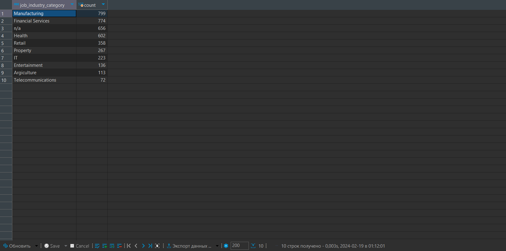
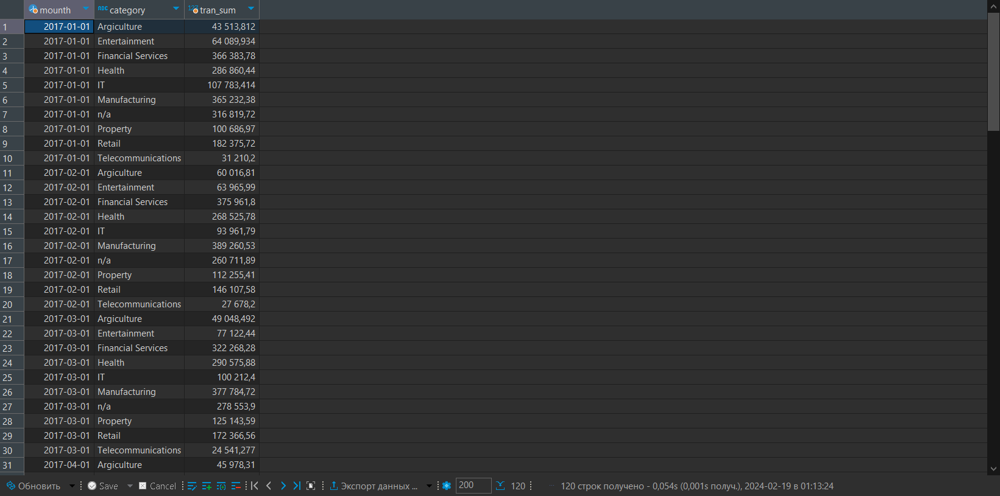
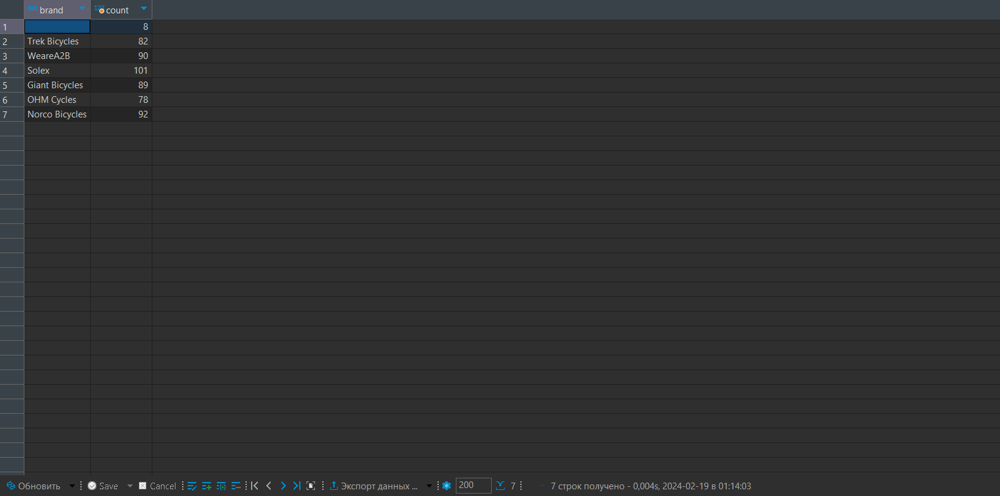
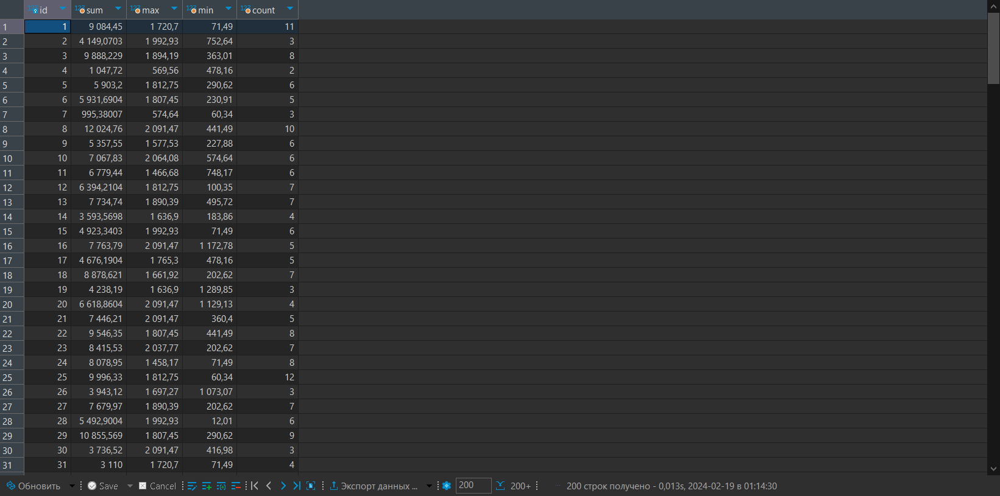
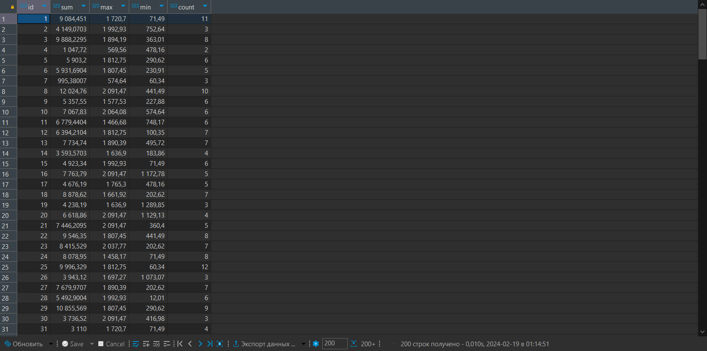
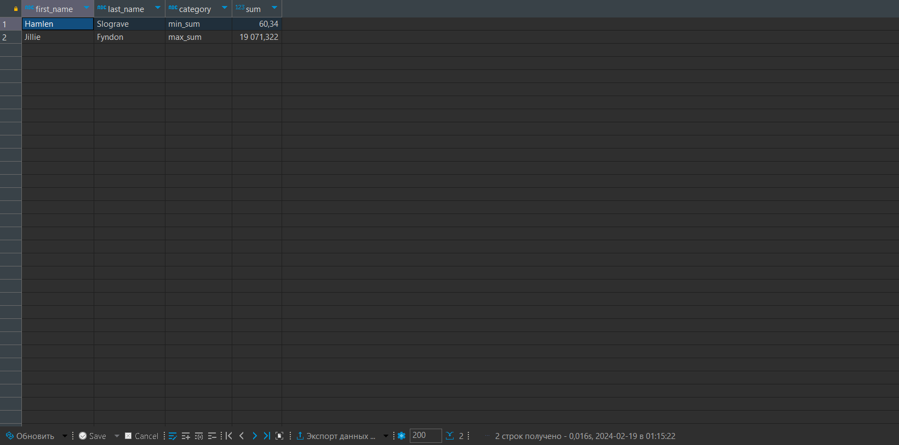
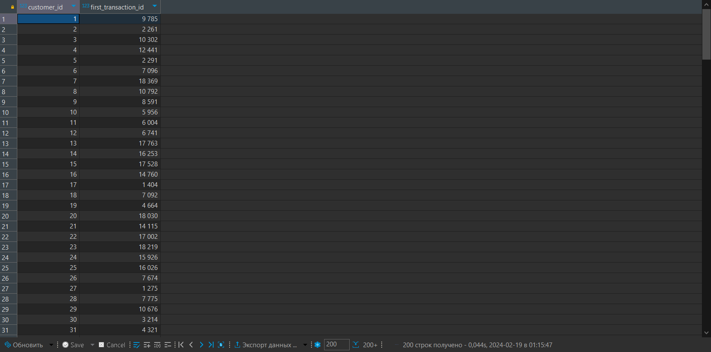
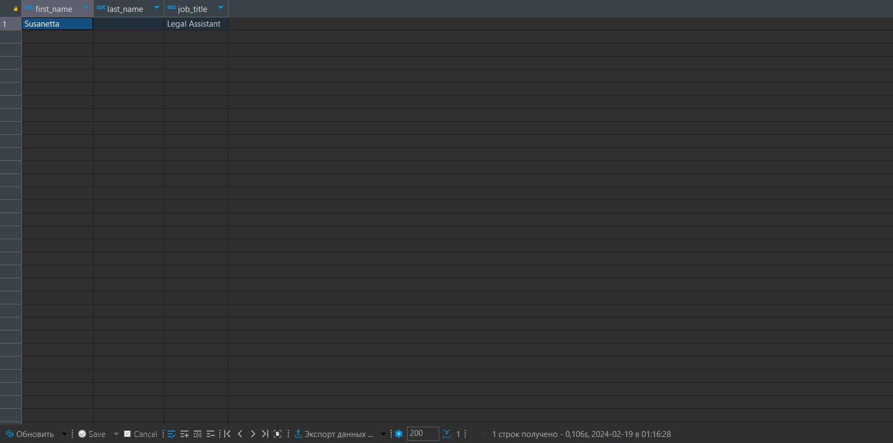

# Домашние задание №3: Группировка данных и оконные функции
## Студент: Глазков Тимур Михайлович

# Задачи:
1. Создать таблицы со следующими структурами и загрузить данные из csv-файлов. 
2. Выполнить следующие запросы:
	- Вывести распределение (количество) клиентов по сферам деятельности, отсортировав результат по убыванию количества.
	- Найти сумму транзакций за каждый месяц по сферам деятельности, отсортировав по месяцам и по сфере деятельности.
	- Вывести количество онлайн-заказов для всех брендов в рамках подтвержденных заказов клиентов из сферы IT.
	- Найти по всем клиентам сумму всех транзакций (list_price), максимум, минимум и количество транзакций, отсортировав результат по убыванию суммы транзакций и количества клиентов. Выполните двумя способами: используя только group by и используя только оконные функции. Сравните результат.
	- Найти имена и фамилии клиентов с минимальной/максимальной суммой транзакций за весь период (сумма транзакций не может быть null). Напишите отдельные запросы для минимальной и максимальной суммы.
	- Вывести только самые первые транзакции клиентов. Решить с помощью оконных функций.
	- Вывести имена, фамилии и профессии клиентов, между транзакциями которых был максимальный интервал (интервал вычисляется в днях).

---

# №1 Создание таблиц:
```sql
create table if not exists customer (
	customer_id int4 primary key
	,first_name varchar(50)
	,last_name varchar(50)
	,gender varchar(30)
	,DOB varchar(50)
	,job_title varchar(50)
	,job_industry_category varchar(50)
	,wealth_segment varchar(50)
	,deceased_indicator varchar(50)
	,owns_car varchar(30)
	,address varchar(50)
	,postcode varchar(30)
	,state varchar(30)
	,country varchar(30)
	,property_valuation int4
);

create table if not exists transaction (
	transaction_id int4 primary key
	,product_id int4
	,customer_id int4
	,transaction_date varchar(30)
	,online_order varchar(30)
	,order_status varchar(30)
	,brand varchar(30)
	,product_line varchar(30)
	,product_class varchar(30)
	,product_size varchar(30)
	,list_price float4
	,standard_cost float4
);
```

# №2 Запросы к БД:

## 1. Вывести распределение (количество) клиентов по сферам деятельности, отсортировав результат по убыванию количества.

```sql
select job_industry_category, count(*) as count
	from customer c
group by job_industry_category
order by count desc;
```
### Результат:



## 2. Найти сумму транзакций за каждый месяц по сферам деятельности, отсортировав по месяцам и по сфере деятельности.

```sql
select date_trunc('month', transaction_date::date)::date as mounth
	   ,c.job_industry_category category
	   ,sum(list_price) tran_sum 
	from transaction t
join customer c 
	on t.customer_id = c.customer_id
group by date_trunc('month', transaction_date::date),
		 c.job_industry_category
order by mounth, category;
```
### Результат:



## 3. Вывести количество онлайн-заказов для всех брендов в рамках подтвержденных заказов клиентов из сферы IT.

```sql
select brand, count(*) count 
	from transaction t
join customer c 
	on t.customer_id = c.customer_id
where t.online_order = 'True'
	and t.order_status = 'Approved'
	and c.job_industry_category = 'IT'
group by brand;
```
### Результат:



## 4. Найти по всем клиентам сумму всех транзакций (list_price), максимум, минимум и количество транзакций, отсортировав результат по убыванию суммы транзакций и количества клиентов. Выполните двумя способами: используя только group by и используя только оконные функции. Сравните результат.

### С помощью group by:

```sql
select c.customer_id id
	   ,sum(list_price) sum
	   ,max(list_price) max
	   ,min(list_price) min
	   ,count(*) count
	from transaction t 
join customer c 
	on t.customer_id = c.customer_id
group by c.customer_id
order by id;
```
### Результат:


---

### С помощью оконных функций:

```sql
select distinct c.customer_id id
	   ,sum(list_price) over id_group sum
	   ,max(list_price) over id_group max
	   ,min(list_price) over id_group min
	   ,count(*)        over id_group count
	from transaction t 
join customer c 
	on t.customer_id = c.customer_id
window id_group as (partition by c.customer_id)
order by id; 
```

### Результат:


## 5. Найти имена и фамилии клиентов с минимальной/максимальной суммой транзакций за весь период (сумма транзакций не может быть null). Напишите отдельные запросы для минимальной и максимальной суммы.

```sql
-- Запрос для создания представления "min_sum"
create or replace view min_sum as 
	select customer_id, sum(list_price) sum
		from transaction
	group by customer_id
	order by sum asc
	limit 1;

-- Запрос для создания представления "max_sum"
create or replace view max_sum as 
	select customer_id, sum(list_price) sum
		from transaction
	group by customer_id
	order by sum desc
	limit 1;
	
-- Результирующий запрос
select first_name
	   ,last_name
	   ,'min_sum' category 
	   ,mins.sum sum
	from customer c
join min_sum mins
	on c.customer_id = mins.customer_id
union all
select first_name
	   ,last_name
	   ,'max_sum' category 
	   ,maxs.sum sum
	from customer c
join max_sum maxs
	on c.customer_id = maxs.customer_id;s
```
### Результат:



## 6. Вывести только самые первые транзакции клиентов. Решить с помощью оконных функций.

```sql
select distinct c.customer_id
	   ,first_value(t.transaction_id) 
	       over id_group as first_transaction_id
	from transaction t 
join customer c 
	on t.customer_id = c.customer_id
window id_group as (partition by c.customer_id 
					order by t.transaction_date::date)
order by customer_id; 
```
### Результат:



## 7. Вывести имена, фамилии и профессии клиентов, между транзакциями которых был максимальный интервал (интервал вычисляется в днях)

```sql
with days_deltas as (
	select distinct c.customer_id,
					abs(t.transaction_date::date -
					lead(t.transaction_date::date) over by_customer)
					as days_delta
		from transaction t 
	join customer c 
		on t.customer_id = c.customer_id 
	window by_customer as (partition by c.customer_id 
						   order by t.transaction_date)
	order by days_delta asc)
	
select first_name, last_name, job_title 
	from customer c
where c.customer_id = (
	select customer_id from days_deltas d
	where d.days_delta = (
		select max(days_delta) from days_deltas));
```
### Результат:


### Код создания таблиц и запросов представлен в sql-script файле [grouping_and_wind_funcs.sql](grouping_and_wind_funcs.sql)
### Все скриншоты результатов запросов находятся в папке [output_screenshots](output_screenshots)
### Исходные данные в CSV формате находятся в папке [data](data)